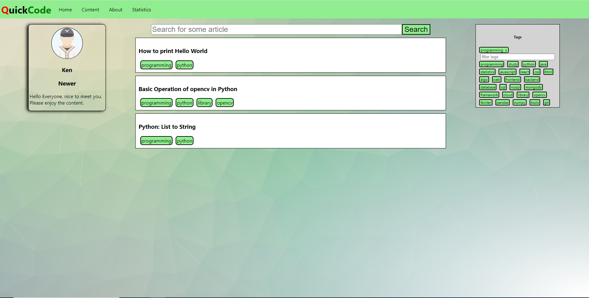
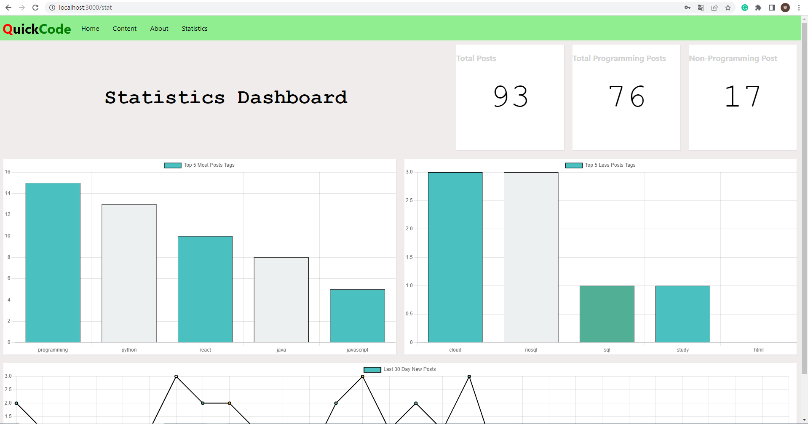
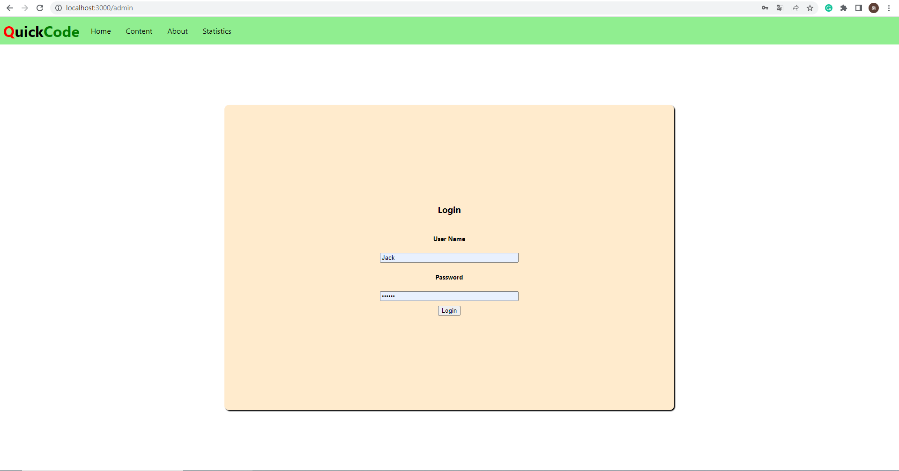
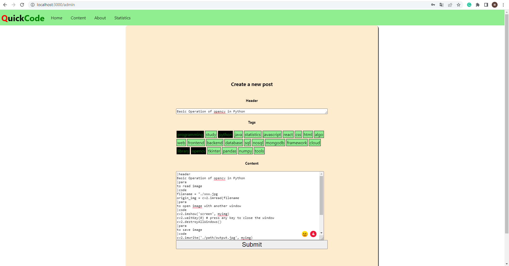
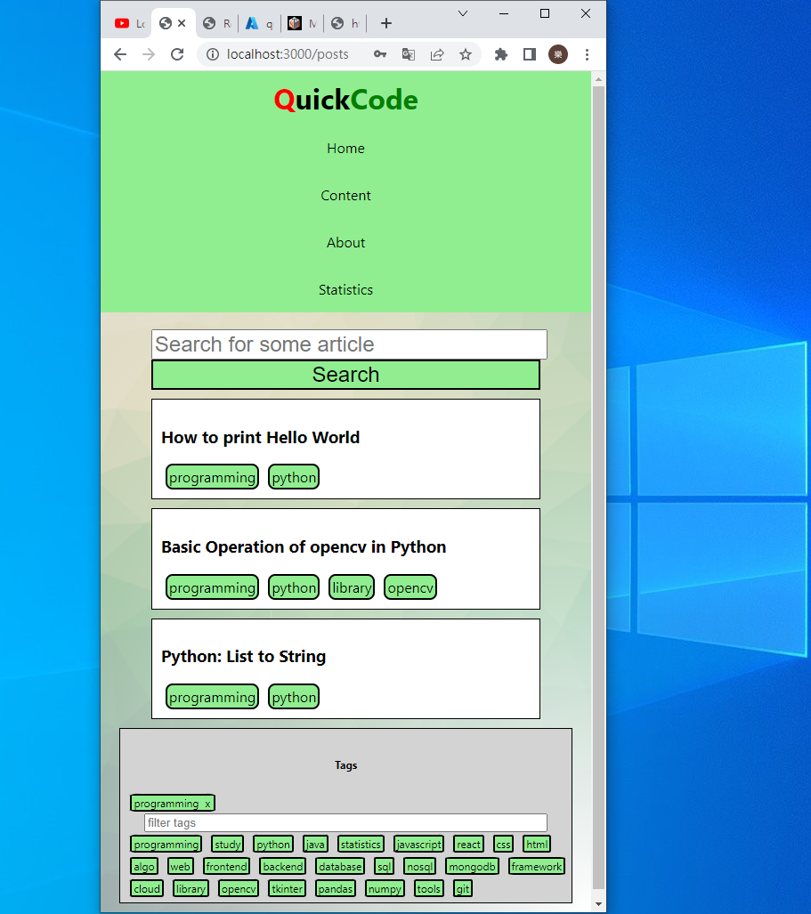

# Welcome to the QuickCode repo

This project is a mern stack blog website project. It mainly served as a blog website for myself to record what I have learnt. It offer tags filter so I search my work easily. I have also designed a parser to parse my new blog post to json object that can be stored in mongodb. This repo contain the frontend part of the project where the backend part is in quickCodeServer.

# Deploy

I have deployed the project in Azure, using Azure web app and Azure cosmosDB. It will be a bit slow in the first run.
The link: Open [https://quickcode.azurewebsites.net](https://quickcode.azurewebsites.net)

# featrues

## Tags search for post

we can use tags to search for the articles easily.

## Statistics for the websie in dashboard

we can view some statistics about the blog posts

## Easy add new post

we can add the new post with tags and easy syntax

## reponsive design

we can view the website in different screen size, such as phone

# Thank you for reading this repo